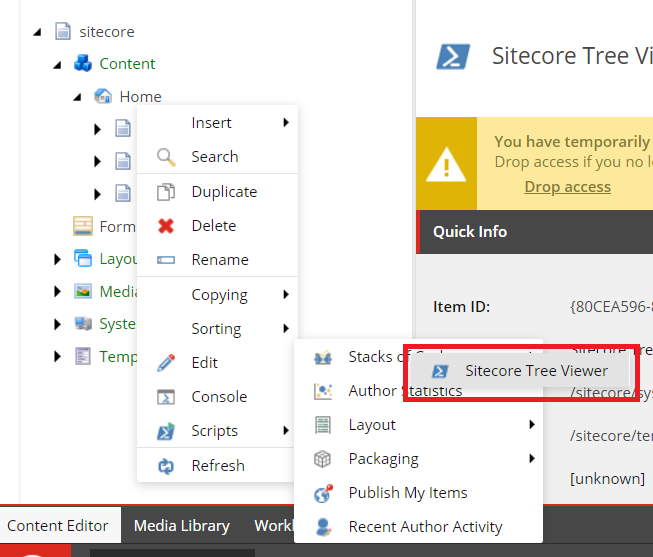
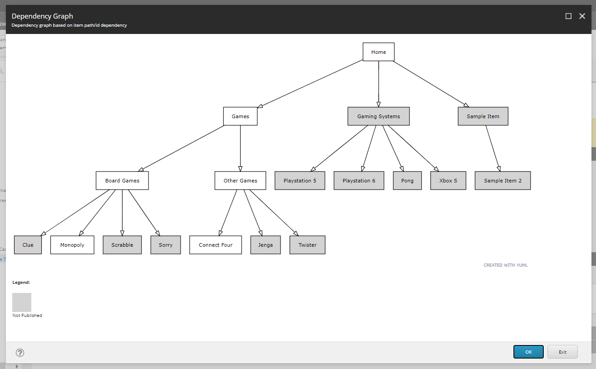
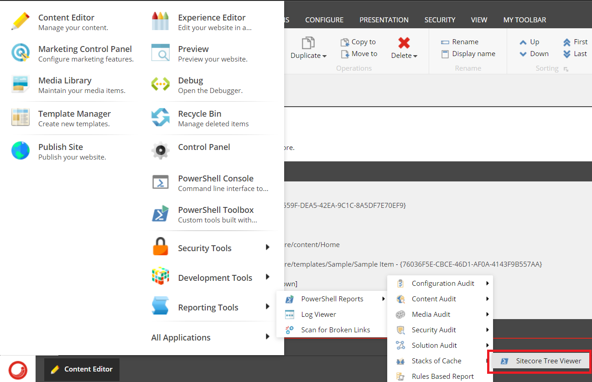
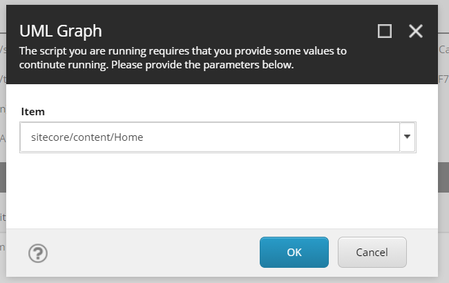

# Hackathon Submission Entry form

## Team name
Stacks of Cache

## Category
Best use of SPE to help Content authors and Marketers

## Description

  This module was created to give content authors an easy way to get a visual representation of a structure in Sitecore.  The initial release also includes some publishing features related to if an item has been published or not.  The tool is available to run in multiple ways and involves selecting a parent item to pass into PowerShell to crawl the tree for descendants.  This is returned to the user as a visual UML graph as large or small as the size of the tree selected.

 Often while working through content migrations and daily updates it is beneficial to have a graphical view of the tree someone is working with.  This tool allows a content editor to go as high up or as low level as they'd like to get a top down view of the structure of any of the items within Sitecore (content, page assets, templates folders, etc.)
This UML diagram solution also gives the content editor an easy to recognize shading for items that haven't yet been published from master to web so they have confidence in what is deployed and what isn't. (edited) 

## Video link

⟹ [Video of usage](https://youtu.be/Ooo4uEMlThQ)

## Pre-requisites and Dependencies

This module is created for Sitecore 10.1. It requires Sitecore Powershell Extensions (versions 6.0-6.2).

## Installation instructions
To use this module, simply install the package located at `.\installation\Sitecore_Tree_Viewer-1.zip`.

Optionally, you can install the package of demo content located at `.\installation\Demo_Content-1.zip`.

For additional help with installing a package in Sitecore, please visit [the Sitecore documentation for installing a package](https://doc.sitecore.com/SdnArchive/Articles/Administration/Installing%20Modules%20and%20Packages.html)

## Usage instructions

There are two ways to use the script: Via right-clicking an item, and by accessing it through the Desktop.

### Right-clicking an item in the Content Editor

After installing the package, you will be able to run the script on the item by right clicking the item, going to Scripts > Stacks of Cache > Sitecore Tree Viewer

You will soon see a tree diagram of the Sitecore folder structure based on the item selected.

### Running the script from the Desktop

You can also access the script from the Desktop by going to Reporting Tools > Powershell Reports > Stacks of Cache > Sitecore Tree Viewer

After clicking, you will see an item picker prompt, where you will need to select a parent item to create the tree off of.

You will soon see a tree diagram of the Sitecore folder structure based on the item selected.

## Comments

### Future Development Considerations

* Heatmaps
  * Colored items by time last updated to show aging or stale content
* Icons
  * Never Publish
  * Future Publish Date
  * Workflow Required
